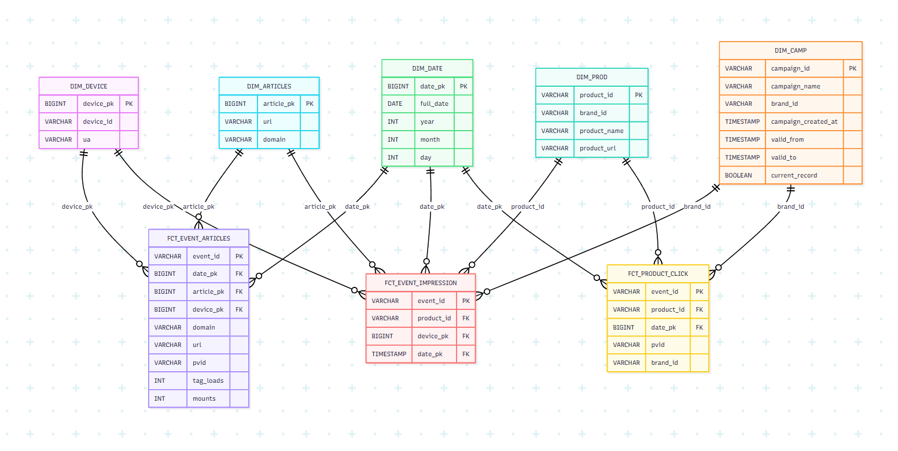

# Event Duck Pipeline

## Introduction*

This project demonstrates a data engineering pipeline that parses raw JSON event data, enriches it with product and campaign dimensions, and transforms it into analysis-ready tables. The pipeline is orchestrated by **Apache Airflow** and uses **DuckDB** as the transformation engine.

The goal is to enable analysis such as:

- Top articles by traffic per domain
- Top clicked products per brand in the last week
- Most impressed product per campaign
- Fill rate (mounts/tagloads) per domain
- Total unique users reached

**Folder Structure**

```text
event-duck-pipeline/
│
├── dags/                  # Airflow DAGs
│   └── etl_duckdb.py
│
├── sql/
│   ├── staging/           # Parse raw JSON into staging tables
│   │   ├── staging_tagloads_mounts.sql
│   │   ├── staging_impressions.sql
│   │   └── staging_clicks.sql
│   │
│   ├── silver/            # Build fact & dimension tables
│   │   ├── dim_articles.sql
│   │   ├── dim_camp.sql
│   │   ├── dim_date.sql
│   │   ├── dim_device.sql
│   │   ├── dim_prod.sql
│   │   ├── fct_event_articles.sql
│   │   ├── fct_event_impression.sql
│   │   └── fct_product_click.sql
│   │
│   └── gold/              # Analysis-ready marts
│       ├── m_article_traffic.sql
│       ├── m_campaign_impressions.sql
│       ├── m_domain_fill_rate.sql
│       ├── m_product_clicks_weekly.sql
│       └── m_user_reach.sql
│
├── data/
│   ├── raw/               # Partitioned raw JSON event files
│   └── dims/              # Dimension CSVs (dim_products.csv, dim_campaigns.csv)
│
├── docker-compose.yml 
├── Dockerfile
├── result.ipynb         # Notebook to validate results from gold layer
├── setup_pipeline.sh      # Script to bootstrap Docker & Airflow
└── remove_pipeline.sh     # Script to clean up resources

```


**Getting Started**

**Prerequisites**

- Docker Deskstop & Docker Compose installed
- Python 3.x installed (for Jupyter Notebook)
- Unix-like shell (Linux/macOS or WSL for Windows)

**Setup and Deployment**

1. **Environment Setup**

Run the provided shell script to set up the environment:
```bash
./setup_pipeline.sh
```

This will:

- Start **Airflow 3.0** inside Docker
    - Initialize a **DuckDB** warehouse file (for transformations)
    - Register and deploy the ETL DAG etl_duckdb into Airflow

Default Airflow credentials:  
Username: airflow  
Password: airflow

1. **Airflow Access**
    - Open the Airflow web UI at: <http://localhost:8080>
    - Locate the DAG **etl_duckdb**
    - Switch it **On**, then click **Trigger DAG** to run the pipeline
    - The pipeline executes the flow: **staging → silver → gold**
    - Monitor DAG runs via the Graph or Tree view
2. **Data Validation**

After the pipeline runs successfully:

- - Open **result.ipynb**
    - Run the notebook cells to validate the Gold layer queries

**Data Architecture**



The project uses a **Star Schema** with 3 fact tables and 5 dimensions.

- **Fact tables**:
  - fct_event_articles (TagLoads & Mounts)
  - fct_event_impression (Product Impressions)
  - fct_product_click (Product Clicks)
- **Dimension tables**:
  - dim_articles
  - dim_camp
  - dim_date
  - dim_device
  - dim_prod

The **Gold Layer** aggregates data into marts (m_article_traffic, m_product_clicks_weekly, m_campaign_impressions, m_domain_fill_rate, m_user_reach) to directly answer analysis questions.


**Remove Resources**

When finished, remove all resources with:
```bash
./remove_pipeline.sh
```

This stops and removes Docker containers, networks, and volumes created for the project.

**Known Limitations & Improvements**

- **DuckDB limitation**: Cannot handle concurrent writes, so not suitable for heavy production workloads. Works fine for this demo.
- **Possible improvements**:
  - Incremental loads & idempotent DAG runs
  - Stronger validation (e.g. Great Expectations, dbt tests)
  - Cloud data warehouse migration (Snowflake/BigQuery/Redshift) for scalability
  - Add monitoring and alerting for better observability